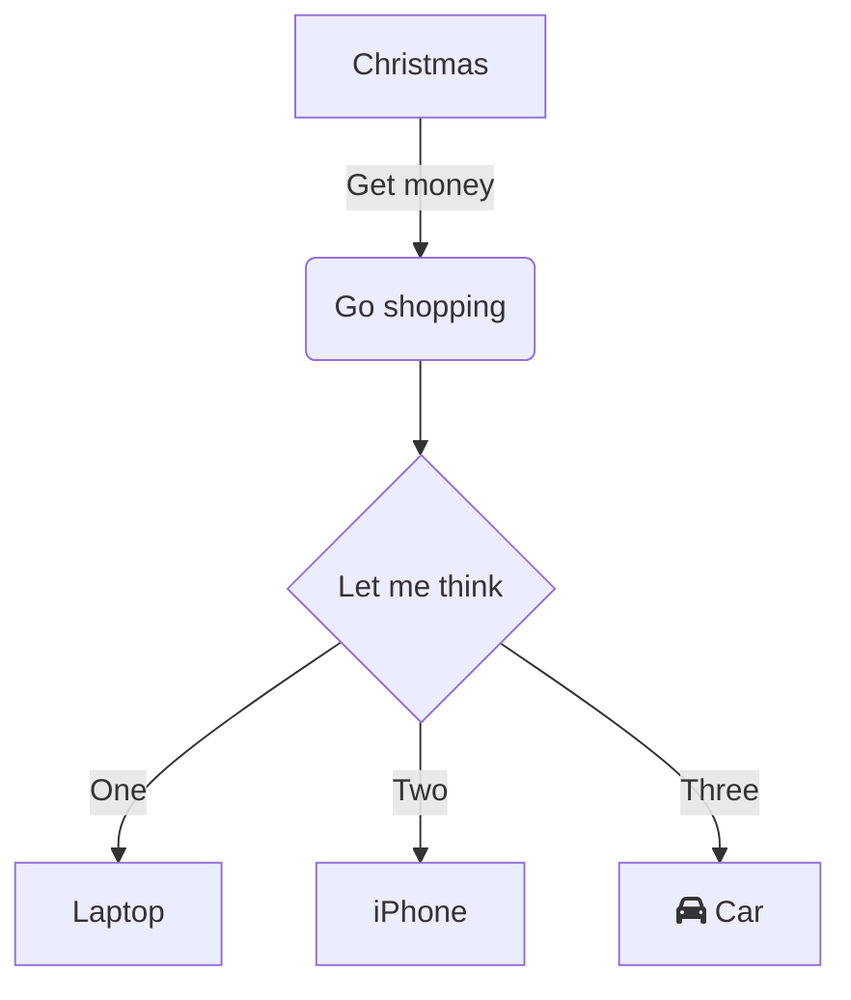

# Tic Tac Toe

Game server and client for tic tac toe game using socket io and nodejs

# Running Server
> cd tic-tac-toe-server\
> npm start

Server will run at localhost:3000\
You can change port in server.js

# Running Client
> cd tic-tac-toe-client\
> npm start

Client will try to connect at localhost:3000\
You can change port and host at index.js

